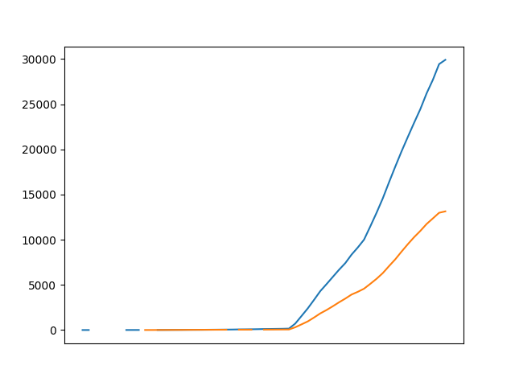

# Week 2 Updates
This week, our group met to determine which data to analyze and generate project ideas. After examining several open data sets, we decided to focus on analyzing Seattle [pet registration data](https://data.seattle.gov/Community/Seattle-Pet-Licenses/jguv-t9rb). This set includes information like the pet's species, breed, owner's zip code, and date of registration. We found this data intriguing as it presents many opportunities for exploring trends and generating engaging, interactive ways to study it.

During our brainstorming session, we came up with several possible projects:
- Analyzing pet species by zip code and correlating them with other variables like demographics, income, and zoning information.
- Creating a cumulative registration dashboard, where users can adjust a line graph and apply different filters to view how pet registration numbers shift.
- Developing prediction models that estimate future registration numbers and establishing an evaluation approach to assess incoming data against the model's predictions.
- Producing a table dashboard that allows for basic data filtering through a web browser.
- Conducting name analyses using natural language processing to identify trends like whether more pets have female or male names or if they are named after people, places, or things.

## Findings
- Dog registrations far outnumber cat registrations, and the growth rate of dog registrations is higher than that of cats.
- The most popular breeds of both dogs and cats align with expectations, but cat breed data is less detailed than dog breed data.
- There are limitations with data availability, as pet registration data only dates back to 2015 and is incomplete. More significant registration numbers only began in 2021.

 
Dog blue, cat orange

### Most Popular Dog Breeds
| Primary Breed                                  | count |
|------------------------------------------------|-------|
| Retriever, Labrador                            | 3309  |
| Retriever, Golden                              | 1524  |
| Chihuahua, Short Coat                          | 1502  |
| German Shepherd                                | 930   |
| Terrier                                        | 848   |
| Poodle, Miniature                              | 841   |
| Poodle, Standard                               | 762   |
| Australian Shepherd                            | 751   |
| Border Collie                                  | 711   |
| Mixed Breed, Medium (up to 44 lbs fully grown) | 660   |

### Most Popular Cat Breeds
| Primary Breed        | count |
|----------------------|-------|
| Domestic Shorthair   | 7307  |
| Domestic Medium Hair | 1589  |
| American Shorthair   | 1158  |
| Domestic Longhair    | 898   |
| Siamese              | 465   |
| Mix                  | 374   |
| Maine Coon           | 227   |
| Ragdoll              | 132   |
| LaPerm               | 116   |
| Siberian             | 94    |

### Cumulative Pet Registrations
| YEAR | MONTH | Cat   | Dog   |
|------|-------|-------|-------|
| 2015 | 10    |       | 1     |
| 2015 | 11    |       | 2     |
| 2015 | 12    | 1     |       |
| 2016 | 3     |       | 3     |
| 2016 | 6     | 2     |       |
| 2016 | 7     |       | 4     |
| 2016 | 8     | 3     |       |
| 2016 | 9     |       | 5     |
| 2016 | 11    |       | 6     |
| 2017 | 1     |       | 7     |
| 2019 | 1     | 4     |       |
| 2019 | 2     | 5     |       |
| 2019 | 6     | 8     | 9     |
| 2019 | 7     | 10    | 10    |
| 2019 | 8     | 13    | 14    |
| 2019 | 9     | 15    | 18    |
| 2019 | 10    | 18    | 20    |
| 2019 | 11    | 23    | 25    |
| 2019 | 12    | 25    | 27    |
| 2020 | 1     | 28    | 29    |
| 2020 | 2     | 31    | 35    |
| 2020 | 3     | 32    | 40    |
| 2020 | 4     | 35    | 44    |
| 2020 | 5     | 37    | 51    |
| 2020 | 6     |       | 59    |
| 2020 | 7     | 40    | 71    |
| 2020 | 8     | 41    | 76    |
| 2020 | 9     | 44    | 85    |
| 2020 | 10    |       | 97    |
| 2020 | 11    | 49    | 113   |
| 2020 | 12    | 53    | 119   |
| 2021 | 1     | 56    | 130   |
| 2021 | 2     | 60    | 140   |
| 2021 | 3     | 62    | 161   |
| 2021 | 4     | 306   | 711   |
| 2021 | 5     | 626   | 1548  |
| 2021 | 6     | 953   | 2392  |
| 2021 | 7     | 1382  | 3334  |
| 2021 | 8     | 1839  | 4303  |
| 2021 | 9     | 2214  | 5079  |
| 2021 | 10    | 2629  | 5877  |
| 2021 | 11    | 3069  | 6672  |
| 2021 | 12    | 3480  | 7405  |
| 2022 | 1     | 3928  | 8346  |
| 2022 | 2     | 4231  | 9137  |
| 2022 | 3     | 4578  | 10007 |
| 2022 | 4     | 5114  | 11472 |
| 2022 | 5     | 5672  | 12979 |
| 2022 | 6     | 6305  | 14582 |
| 2022 | 7     | 7082  | 16369 |
| 2022 | 8     | 7835  | 18103 |
| 2022 | 9     | 8687  | 19787 |
| 2022 | 10    | 9505  | 21378 |
| 2022 | 11    | 10279 | 22939 |
| 2022 | 12    | 10974 | 24459 |
| 2023 | 1     | 11741 | 26198 |
| 2023 | 2     | 12356 | 27699 |
| 2023 | 3     | 12982 | 29443 |
